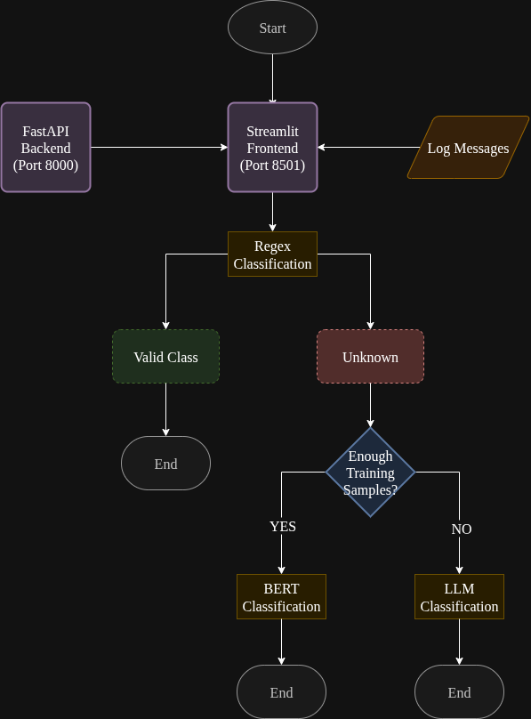

# LogWarn - Intelligent Log Classification System

A log classification system that implements a multi-tiered approach using regex patterns, BERT embeddings, and Large Language Models (LLMs) to categorize system log messages.

## Features

- Multi-tiered classification pipeline with fallback mechanisms
- RESTful API with FastAPI backend
- Interactive web interface with Streamlit frontend
- Source-aware processing for optimal classification strategies
- Local LLM integration via Ollama for enhanced privacy

## Architecture



The system implements a three-tier classification approach:
1. **Regex Processing**: Fast pattern matching for common log formats
2. **BERT Classification**: Machine learning for complex pattern recognition
3. **LLM Processing**: Advanced natural language understanding for edge cases

## Project Structure

```
log_warn/
├── app.py                    # FastAPI application
├── streamlit.py             # Streamlit frontend
├── classifier.py            # Main classification logic
├── pipeline/               # Classification processors
│   ├── regex_processor.py  # Pattern matching engine
│   ├── bert_processor.py   # ML classification model
│   └── llm_processor.py    # LLM integration
├── models/                 # Trained model artifacts
├── training/              # Training data and notebooks
├── resources/             # Static resources and outputs
└── requirements.txt       # Python dependencies
```

## Installation

### Prerequisites
- Python
- Ollama (for local LLM processing)

### Setup
```bash
git clone https://github.com/Ginml/LogWarn.git
pip install -r requirements.txt
```

### Ollama Setup
```bash
curl -fsSL https://ollama.ai/install.sh | sh
ollama pull llama3.1:8b
```

## Quick Start

### Web Interface
```bash
# Start backend
uvicorn app:app --reload

# Start frontend (new terminal)
streamlit run streamlit.py
```
Access the application at http://localhost:8501